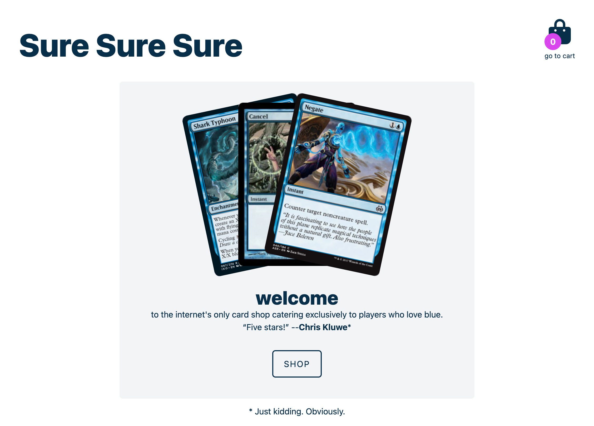
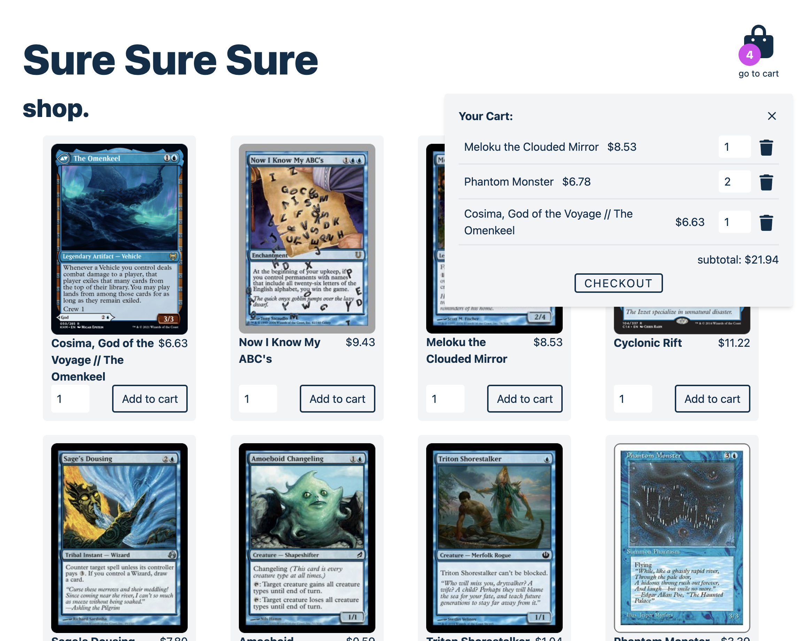
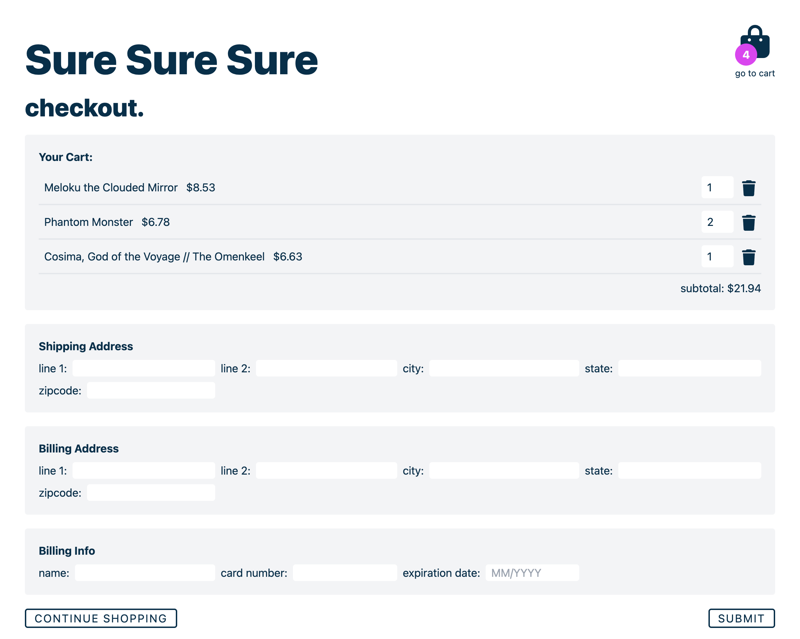

# Shopping Cart

A mock shopping cart created as part of the [Odin Project](https://www.theodinproject.com).

## Features

- Fetch card data from the Magic the Gathering API.
- Routes using React Router
- Tests with Vitest and React Testing Library

## Built with
- React
- Vite
- Tailwind

### Screenshots

Home: 

Shop:

Checkout: 

